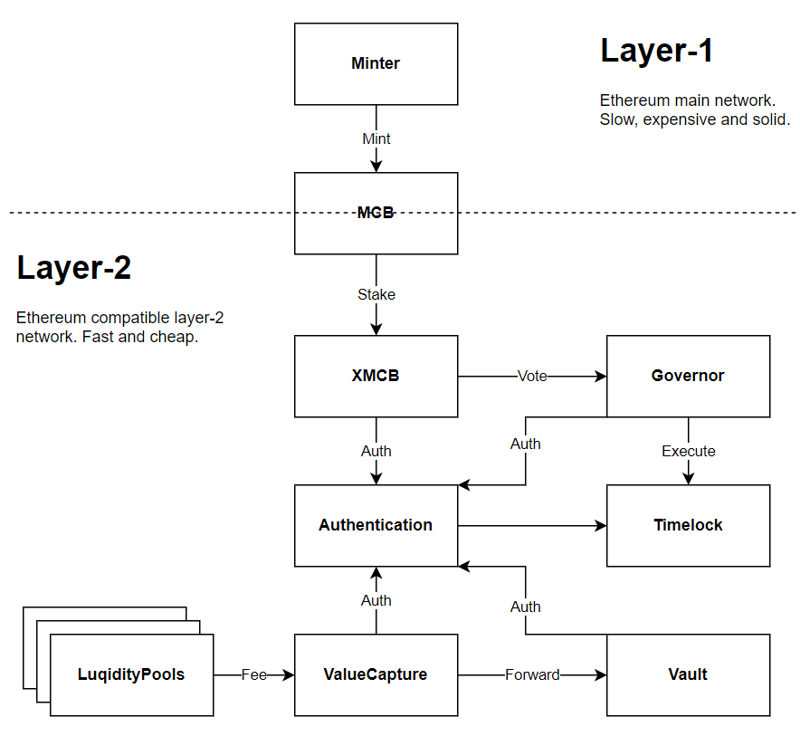

# MCDEX DAO

[TOC]


## Overview




## Contracats on Layer-1

### Minter

Minter is expected to take over the role of MCB minter.

It will be deployed on layer-1, but expected to read captured value from layer-2.


## Contracts on Layer-2

### Authentication

#### Overview

Authentication is basically the `AccessControl` contract implemented by `OpenZepplin`.It is the central permission management module of all the DAO contracts.

Every authentication request is sent to this contract, then been test if an account has granted specific role to call specific function.

The `DEFAULT_ADMIN_ROLE` (0x0) role will be set to contract deployer to help to initialize the trust chain of the DAO system and finally will be set to `Timelock` contract after all initialization finished.

#### Methods

```javascript
function hasRoleOrAdmin(bytes32 role, address account) external view returns (bool)
```

External contracts to check authority should call this method to get whether an account has the permission.

For other methods, check [openzeppelin-contracts-upgradeable/AccessControlUpgradeable.sol](https://github.com/OpenZeppelin/openzeppelin-contracts-upgradeable/blob/release-v3.4/contracts/access/AccessControlUpgradeable.sol) for details

#### Roles

In DAO system, roles are represented by a bytes32 which is calculated from the string value of the role itself. For example, the value of `DEFAULT_ADMIN_ROLE` can be retrieved from `keccak256("DEFAULT_ADMIN_ROLE")`.

The `DEFAULT_ADMIN_ROLE` is not only the controller of the authentication module, but also the 'role admin' of all sub-roles. That means only the `DEFAULT_ADMIN_ROLE` can grant or revoke method to change the role of an account.

*By design, `DEFAULT_ADMIN_ROLE` is able to perform all actions that only available to the sub-roles. If not stated, all role designs should follow this rule.*


### Vault

#### Overview

Vault contract is used to store assets owned by the DAO. It has some transfer methods to helper call to transfer stored assets to destination.

Vault is controlled by `Timelock` contract which means every transfer will be and only can be initiated by governance proposal.

#### Methods

There are 3 transfer function to help caller to transfer assets to some where.

```javascript
function transferETH(address recipient, uint256 value) external onlyAuthorized

function transferERC20(
	address token,
	address recipient,
	uint256 amount
) external onlyAuthorized

function transferERC721(
	address token,
	uint256 tokenID,
	address recipient
) external onlyAuthorized
```

For an unsupported token, the transfer is able to be achieved though `execute`

```javascript
function execute(
	address to,
	bytes calldata data,
	uint256 value
) external onlyAuthorized
```

All the methods above require authentication to be called.

#### Roles

`VAULT_ADMIN_ROLE` is a reserved role who is able to call the transfer methods. It will be left unset before encountering special needs. So the vault should be actually controlled by  the `Timelock` contract only.


### ValueCapture

#### Overview

The ValueCapture contract is mainly to receives fee from pools (`LiquidityPool`) and count the total value received in USD. The captured value is related to the MCB releasing model, see [whitepaper]() for details.

Since the fee tokens collected are various, the ValueCapture relies on external exchanges to convert various tokens into whitelisted USD token (eg. USDT, USDC and so on).

Also, for tokens that has no liquidity, the admin can directly forward them to vault without conversion. Token forwarded through this way will not be counted into captured value.

#### Methods

```javascript
function addUSDToken(address token, uint256 decimals) public onlyAuthorized

function removeUSDToken(address token) public onlyAuthorized
```

These two method is used to maintain the USD whitelist.

```javascript
function setConvertor(
	address token,
	address oracle,
	address convertor_,
	uint256 slippageTolerance
) public onlyAuthorized
```

The admin can set a convertor for a token. Besides the convertor contract, the admin should also supply a oracle to determine the market price of the token being converted. And the slippage tolerance defines the max price loss  [`(dealPrice - marketPrice) / marketPrice`] in a conversion.

```javascript
function forwardAsset(address token) public onlyAuthorized
```

Convert token into whitelisted USD.

Any one is able to call this method but should make sure the slippage of price within the range set by admin, or the transaction will be reverted.

```javascript
function forwardETH(uint256 amount) public

function forwardERC20Token(address token, uint256 amount) public onlyAuthorized

function forwardERC721Token(address token, uint256 tokenID) public onlyAuthorized
```

Directly transfer asset to vault. All the transferred value will not be counted into the captured value.

#### Roles

`VALUE_CAPTURE_ADMIN_ROLE` is able to:

- maintains USD whitelist;
- maintain convertors;
- forward asset directly to vault.

Calling `forwardAsset` does not need special permission.


### XMCB

#### Overview

XMCB is implemented based on `Comp` token crafted by Compound. It is a non-transferrable, delegateable ERC20 token with snapshot mechanism applied on account balance, mainly used as a proof of MCB staking.

User can deposit and withdraw MCB for XMCB at any time. There no lock on withdrawal but user has to afford a penalty (defined by `withdrawalPenaltyRate`, usually 5%) on withdrawal MCB. The penalty will be shared by all the remaining XMCB holders.

Another usage of XMCB is to broadcast deposit / withdraw calls to all registered components. A component is a external contract that depends on user XMCB deposited balance to achieve various activities, say, mining.

#### Methods

```javascript
function setWithdrawalPenaltyRate(uint256 withdrawalPenaltyRate_) public onlyAuthorized
```

The admin is able to set withdrawal penalty. New penalty will only applied to transactions after penalty rate changed. The rate shall not exceed 100%.

```javascript
function deposit(uint256 amount) public

function withdraw(uint256 amount) public
```

As mentioned above, user deposits MCB into contract will always receive the same amount of XMCB. User always loses a percentage of withdrawal amount when withdraws MCB from XMCB.

The last withdrawal which makes the deposited balance to 0 will ignore the penalty. User will get all his remaining balance.

For example, assuming the penalty rate is 5%:

- Bob deposits 100 MCB and gets 100 XMCB back;
- Alice deposits 100 MCB and gets 100 XMCB back;
- Alice try to withdraws 100 MCB with 100 XMCB and gets 95 MCB back;
- Now Bob has 105 XMCB;
  - If there is no other user, Bob is able to withdraw 105 MCB with 105 XMCB.
  - If there is other user, Bob is able to withdraw 99.75 MCB with 105 XMCB.


```javascript
function addComponent(address component) public onlyAuthorized

function removeComponent(address component) public onlyAuthorized
```

Management interfaces to add component to XMCB or remove component from XMCB.

```javascript
function delegate(address) public

function delegateBySig(address,uint256,uint256,uint8,bytes32,bytes32) public
```

XMCB holder can delegate the 'vote power' to another one. By default, the delegate of user is himself.

#### Roles

`XMCB_ADMIN_ROLE` is able to set the value of `withdrawPenaltyRate`.


### GovernorAlpha && Timelock

GovernorAlpha and Timelock are also created based on the contracts with the same names from Compound. Most of their functions are just left unchanged.  The GovernorAlpha takes the XMCB token as its voting token.

There is some changes on the contract:

- code updates according to new solidity compiler version (0.7.4);

- The values of `quorumVotes` and `proposalThreshold`  now use the dynamic amount based on current `totalSupply` of MCB on creating proposal, instead of two fixed amounts.

Timelock implements a transaction executor with proper delay. It is the actual admin of most modules.

